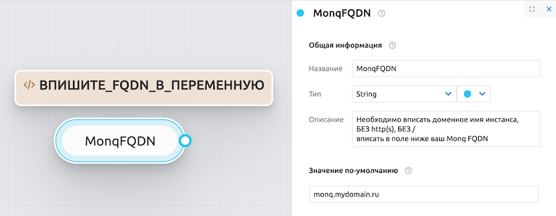
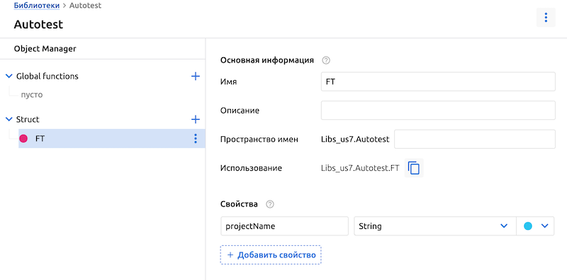
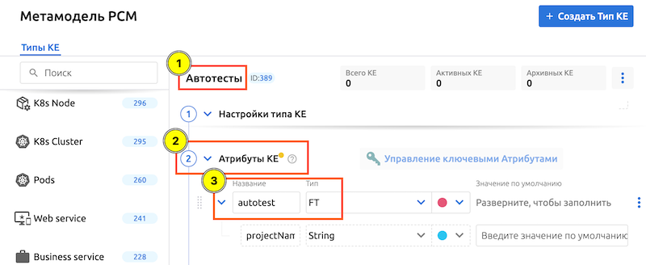
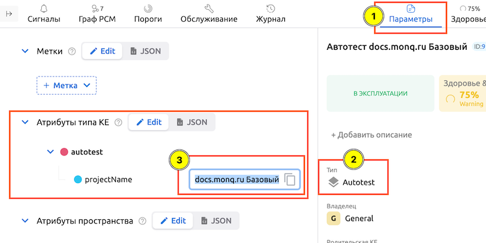
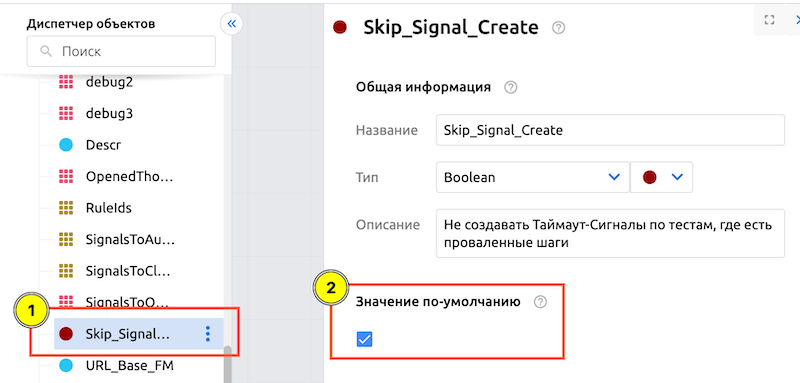

# Базовые сценарии обработки отчетов автоматического тестирования

> [!WARNING]
> ВСЕ ПРЕДСТАВЛЕННЫЕ СЦЕНАРИИ ЯВЛЯЮТСЯ ТОЛЬКО ПРИМЕРАМИ РЕАЛИЗАЦИИ СЦЕНАРИЕВ АВТОМАТИЗАЦИИ! 
>
> Их можно и нужно дорабатывать под свои потребности. 

> [!NOTE]
> Все сценарии после импорта и первоначальной настройки необходимо **Скомпилировать** и **Активировать**.

## Содержание

- [Сценарий обработки Allure отчетов](#сценарий-обработки-allure-отчетов)
- [Сценарий создания Сигналов на основе Результатов Автотестов](#сценарий-создания-сигналов-на-основе-результатов-автотестов)
- [Сценарий привязки Порогов к КЕ](#сценарий-привязки-порогов-к-ке)
- [Сценарий создания Сигналов на основе Метрик Автотестов](#сценарий-создания-сигналов-на-основе-метрик-автотестов)

## Сценарий обработки Allure отчетов

[**Autotest Builds Parser.txt**](./Autotest%20Builds%20Parser.txt)

Тип сценария: `BuildProcessor`

Этот сценарий разбирает входящий zip-архив с отчетом Allure, анализирует содержимое, формирует метрики и отправляет результаты в маршрутный узел для формирования Сигналов.

Если в Конфигурации проекта Автотеста включен Сбор метрик и указан Поток, куда они будут сохраняться - генерироваться они будут именно в этом сценарии.   
Для примера реализована генерация 3 метрик:
1. fm_autotest_steps_duration - длительность ШАГА
2. fm_autotest_testcases_duration - длительность ТЕСТ-КЕЙСА
3. fm_autotest_duration - длительность ВСЕГО автотеста

Предварительная настройка сценария не требуется.

## Сценарий создания Сигналов на основе Результатов Автотестов

[**Autotest Signal by Test Results.txt**](./Autotest%20Signal%20by%20Test%20Results.txt)

Тип сценария: `SignalProcessor`

> [!IMPORTANT]
> Для работы требуется активированный [**Сценарий обработки Allure отчетов**](#сценарий-обработки-allure-отчетов)

Этот сценарий обрабатывает данные о прохождении автоматических тестов, полученные из предыдущего сценария.

При создании Сигнала к нему прикрепляется ссылка на страницу с Проектом Автотеста, а также скриншот с ошибкой проваленного шага, если он был приложен к сборке.

Перед компиляцией необходимо ввести FQDN вашего инстанса в переменную MonqFQDN.

## Сценарий привязки Порогов к КЕ

[**Autotest Bind Metrics to CIs.txt**](./Autotest%20Bind%20Metrics%20to%20CIs.txt)

Тип сценария: `ThresholdsProcessor`

> [!IMPORTANT]
> Для работы требуется активированный **Сценарий обработки Allure отчетов**, настроенная Библиотека автоматизации и Тип привязываемой КЕ. 

Этот сценарий необходим, если есть потребность в сборе метрик из автотестов, привязке их к соответствующим КЕ с тем, чтобы позже открывать Сигналы в случае превышения временных лимитов на выполнение автотестов.

Для работы этого сценария необходима предварительная настройки пространства:
1. Настройки → Настройки автоматизации → Библиотеки:  
    - создать библиотеку `Autotest`
    - в ней создать новую структуру `FT`
    - в структуре добавить Свойство `projectName` с типом *string*

2. Настройки → Настройка CMDB:  
    - создать новый тип КЕ `Автотесты`
    - добавить Атрибуты КЕ, назвать новый Атрибут `autotest`, тип - в поиске выбрать ранее созданную структуру `FT`

3. Подготовить привязываемые КЕ:  
    - создать новые КЕ для связки с Порогами/Автотестами и назначить им новый тип `Автотесты`. Либо использовать ранее созданные, но назначить им этот Тип КЕ
    - после назначения типа у них появятся Атрибуты типа КЕ в Параметрах - указать в поле `projectName` имя Проекта исследуемого Автотеста (важно точное совпадение с названием проекта со страницы Автотестов)

4. Правила и действия → Правила порогов:  
    - импортировать подготовленное правило [Threshold Rule Steps Duration.txt](./Threshold%20Rule%20Steps%20Duration.txt)
    - указать в нем Поток данных, в который отправляются метрики из Проекта Автотеста
    - настроить интервалы, название и уровни под свои потребности
    - **АННОТАЦИИ НЕ МЕНЯЙТЕ!** Именно по этому полю данный сценарий будет сверять данные из метрик и атрибутов КЕ и в случае совпадения - выполнять привязку

5. В импортированном сценарии указать ID Правил порогов в переменной `RuleIds`

6. **Скомпилировать** и **Активировать** Сценарий, **Запустить** Правило порогов

> [!NOTE]
> Описанная настройка для данного сценария не является единственно верной. Принцип привязки можно реализовать и свой, например на основе Меток в КЕ. Главное - уловить смысл: у связываемых Порогов и КЕ должно быть что-то общее. Фильтрацию и сравнение этого общего необходимо отразить в сценарии.

## Сценарий создания Сигналов на основе Метрик Автотестов

[**Autotest Signal by Thresholds (test timeout).txt**](./Autotest%20Signal%20by%20Thresholds%20(test%20timeout).txt)

Тип сценария: `SignalProcessor`

> [!IMPORTANT]
> Для работы требуется наличие **всех вышеописанных сценариев**!

Этот сценарий обрабатывает установленные Пороги и, при превышении указанных в Правилах порогов лимитов, создает Сигналы. 

К Сигналам привязываются 2 ссылки: на сработавший Порог и на страницу Проекта Автотеста.

В импортированном сценарии необходимо указать ID Правил порогов в переменной RuleIds  

Дополнительно реализована опция корреляции Сигналов по Результатам тестов и по Порогам:
можно подавить создание новых Сигналов на основе Порогов метрик в случае, если какой-то из шагов Автотеста был провален. Для этого необходимо активировать чекбокс в переменной `Skip_Signal_Create`:
 

Чтобы при этом автоматически закрылись ранее созданные на основе Порогов метрик Сигналы, нужно также подключить Планировщик запусков:  

Сценарий при этом с указанной частотой будет:
1. Искать открытые Сигналы проваленных Автотестов. Если найдены -
2. Искать открытые Сигналы Порогов. Если найдены -
3. Закрывать их.