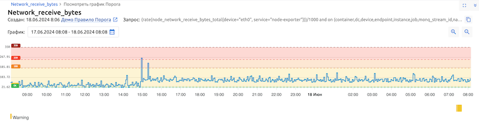

# Базовые примеры сценариев

> [!WARNING]
> ВСЕ ПРЕДСТАВЛЕННЫЕ СЦЕНАРИИ ЯВЛЯЮТСЯ ТОЛЬКО ПРИМЕРАМИ РЕАЛИЗАЦИИ СЦЕНАРИЕВ АВТОМАТИЗАЦИИ! 
>
> Их можно и нужно дорабатывать под свои потребности. 

> [!NOTE]
> Все сценарии после импорта и первоначальной настройки необходимо **Скомпилировать** и **Активировать**.

> [!NOTE]
> Если сценарии должны работать только с определенными правилами Порогов, их id нужно указать в настройках функции `FilterStruct` и отключить передачу управления по пину *False*. Если оба пина *True* и *False* оставить подключенными, сценарий будет срабатывать по всем Правилам Порогов в пределах Рабочей группы. 

## Содержание

- [Сценарий привязки Порогов метрик к КЕ](#сценарий-привязки-порогов-метрик-к-ке)
- [Сценарий создания Сигналов на основе срабатывания Порогов по метрикам](#сценарий-создания-сигналов-на-основе-срабатывания-порогов-по-метрикам)

## Сценарий привязки Порогов метрик к КЕ

[**Bind Thresholds to CIs.txt**](./Bind-Thresholds-to-CIs.txt)

Тип сценария: `ThresholdsProcessor`

Сценарий предназначен для привязки Порогов метрик к Конфигурационным Единицам.
Главным принципом для привязки любых объектов в Monq является корреляция некоторого общего признака этих объектов. В данном демонстрационном сценарии для корреляции Порогов и КЕ сравниваются помещенные в аннотацию `bindci` правила Порога метки метрик (`pod`), и кастомные атрибуты КЕ `commonPropertyAttr` + `commonPropertyKey`.

Для работы этого сценария необходимо выполнить следующие настройки:
1. в настройках CMDB выбрать Тип КЕ (или создать новый), в рамках которого планируется привязывать Пороги
2. в секции **Атрибуты КЕ** добавить новый Атрибут 
    **!точно соблюдайте написание значений, они используются в сценарии!**
    - Название: `commonPropertyAttr`
    - Тип: `Dynamic`
    - Значение по-умолчанию: `{ "commonPropertyKey": ""}`

3. в параметрах каждой КЕ этого типа появится новый атрибут. Его нужно заполнить (вручную или автоматически) уникальным значением, совпадающим с уникальным значением в метках метрики в следующем формате:
    `{ "commonPropertyKey": "уникальное значение"}`

4. в правиле Порога добавить Аннотацию:
    - Название: `bindci`
    - Значение: `{{ Metric.Labels.pod }}`, вместо `pod` указать свою метку метрики, по которой будет определяться принадлежность Порога к КЕ

### Компоненты и Слоты
Для оценки состояния покрытия мониторингом в типах КЕ опционально можно задать Слоты Компонентов и при привязке Порогов к КЕ указывать к какому из Слотов выполнять эту привязку. 

Демонстрационный сценарий уже включает заготовку для использования этой функции, но требуется выполнить несколько настроек вашего пространства Monq:
1. в настройках CMDB выбрать Тип КЕ (или создать новый), в рамках которого планируется привязывать Пороги с указанием Слотов Компонентов
2. выбрать (или создать новый) компонент, в котором будут указаны Слоты
3. добавить Слоты ([docs 1](https://docs.monq.ru/docs/guide/administration/cmdb-metamodel#%D0%BD%D0%B0%D1%81%D1%82%D1%80%D0%BE%D0%B9%D0%BA%D0%B8-%D0%BF%D0%BE%D0%BA%D1%80%D1%8B%D1%82%D0%B8%D1%8F-%D0%BC%D0%BE%D0%BD%D0%B8%D1%82%D0%BE%D1%80%D0%B8%D0%BD%D0%B3%D0%BE%D0%BC), [docs 2](https://docs.monq.ru/upgrade/v7/changelog/v7-14-0#%D0%BF%D0%BE%D0%BA%D1%80%D1%8B%D1%82%D0%B8%D0%B5-%D0%BC%D0%BE%D0%BD%D0%B8%D1%82%D0%BE%D1%80%D0%B8%D0%BD%D0%B3%D0%BE%D0%BC))

4. в Правилах Порогов **обязательно** добавить в Аннотации новое поле с именем `slot` и указать один из Слотов, созданных в п.3,
(и опционально) добавить поле `component`, если Компонентов >1 или название по-умолчанию единственного изменено и ≠ `Common`. В качестве значения указать имя Компонента.

> [!NOTE]
> Если `component` в Аннотациях не задан, привязка будет выполняться к компоненту по-умолчанию с именем `Common`.
>
> У каждого Компонента могут быть собственные Слоты. Это необходимо учитывать при указании имен Компонентов и Слотов в Аннотациях правил Порогов.

## Сценарий создания Сигналов на основе срабатывания Порогов по метрикам

[**Signal Processor for Thresholds.txt**](./Signal-Processor-for-Thresholds.txt)

Тип сценария: `SignalProcessor`

> [!IMPORTANT]
> Даже если привязка Сигналов и Порогов к КЕ не планируется, для работы сигнального сценария требуется наличие активированного [**Сценария привязки Порогов метрик к КЕ**](#сценарий-привязки-порогов-метрик-к-ке), т.к. именно в него первоначально поступают события по порогам и выполняется переадресация этих данных в сигнальный сценарий.

Этот сценарий обрабатывает изменяющиеся пороговые значения метрик и на основе установленной критичности Порогов, создает, подтверждает или закрывает Сигналы.

Если необходимые для работы сценария привязки Порогов метрик к КЕ не были выполнены и у Порогов нет привязанных к ним КЕ, то Сигналы по этим Порогам также будут создаваться без привязки к КЕ.

В качестве дополнительной информации к Сигналу может быть добавлена ссылка на Порог, приведший к открытию Сигнала. Чтобы это произошло, необходимо заполнить локальную переменную `_FQDN` доменным именем инсталляции Monq в формате `monq.domain.ru`

