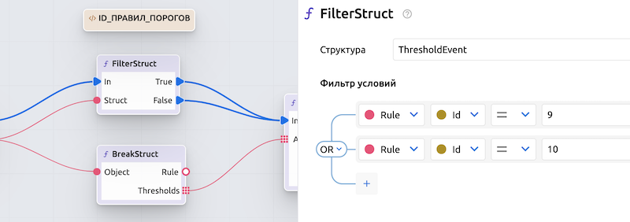

# Базовые примеры сценариев

> [!WARNING]
> ВСЕ ПРЕДСТАВЛЕННЫЕ СЦЕНАРИИ ЯВЛЯЮТСЯ ТОЛЬКО ПРИМЕРАМИ РЕАЛИЗАЦИИ СЦЕНАРИЕВ АВТОМАТИЗАЦИИ! 
>
> Их можно и нужно дорабатывать под свои потребности. 

> [!NOTE]
> Все сценарии после импорта и первоначальной настройки необходимо **Скомпилировать** и **Активировать**.
<!-- 
> [!NOTE]
> Если сценарии должны работать только с определенными правилами Порогов, их id нужно указать в настройках функции `FilterStruct` и отключить передачу управления по пину *False*. Если оба пина *True* и *False* оставить подключенными, сценарий будет срабатывать по всем Правилам Порогов в пределах Рабочей группы.  -->
